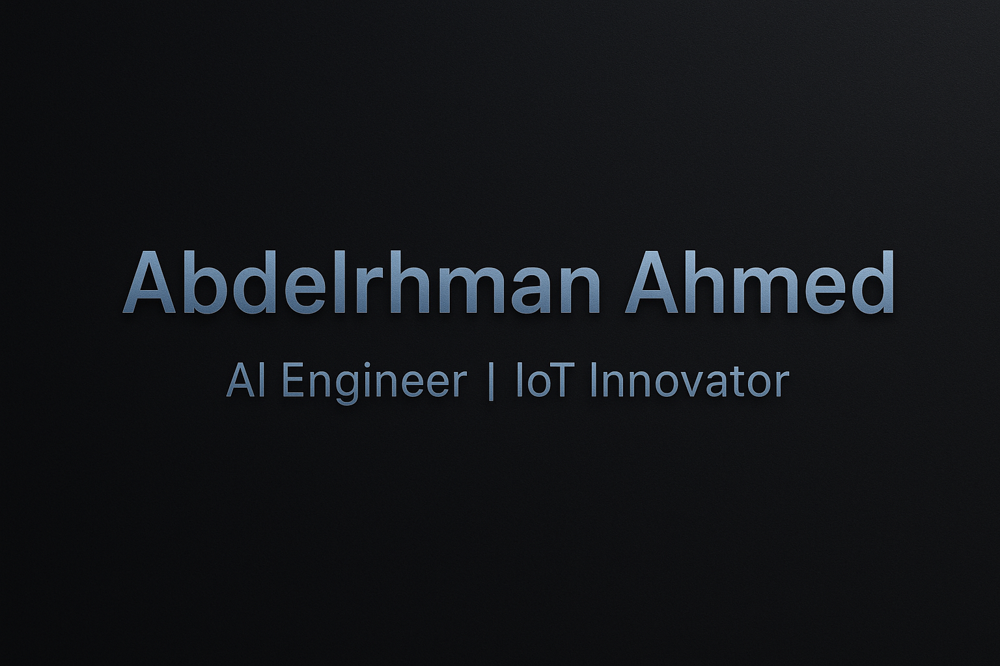

<!-- Profile README for AbdoAhmed666 -->

  

  

---

### 🧠 About Me
I’m **Abdelrhman Ahmed Mohamed Ibrahim**, an **AI Engineer** passionate about building intelligent systems that connect **Machine Learning with IoT** to create real-time, smart solutions.  
I love developing projects that combine **AI models**, **Edge devices**, and **Cloud platforms** to solve real-world problems.

📍 Alexandria, Egypt  
📧 **abdoibrahim122000@gmail.com**  
🔗 [LinkedIn](https://www.linkedin.com/in/abdelrhman-ahmed-92a432260/) • [GitHub](https://github.com/AbdoAhmed666)

---

### 🚀 Featured Projects

| Project | Description | Tech |
|----------|--------------|------|
| 🤖 [Smart Armband using EMG & ML](https://github.com/AbdoAhmed666/Smart-Armband) | Predicts hand gestures using EMG signals and controls smart devices in real-time | Python, TensorFlow, Firebase |
| 🏥 [Nursing Robot with AI Chatbot](https://github.com/AbdoAhmed666/Nursing-Robot) | AI-powered assistant robot for healthcare environments | NLP, Speech Recognition, Deep Learning |
| 🎵 [AI Music Popularity Predictor](https://github.com/AbdoAhmed666/Music-AI) | Predicts song popularity using audio features and ML models | Python, Librosa, Flask |
| 🧬 [AML Cell Image Classifier](https://github.com/AbdoAhmed666/AML-CNN) | Classifies leukemia cell images using CNNs | Keras, OpenCV |

---

### 🧩 Tech Stack

  

---

### 📊 GitHub Stats

  
  

---

### 🌐 Connect with Me

  
  
  

---

### ⚡ Fun Fact
> "The future belongs to those who can merge **intelligence with innovation** — bridging humans and machines."

---

  

